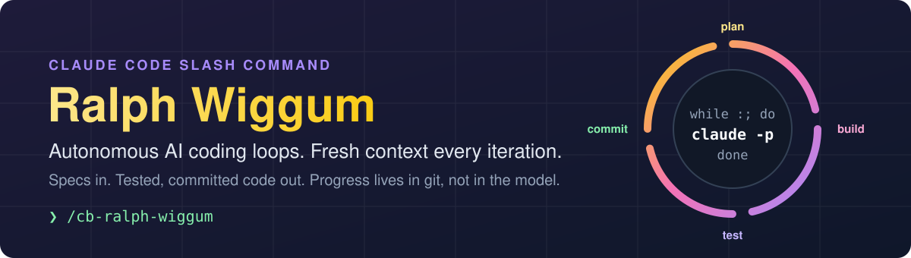
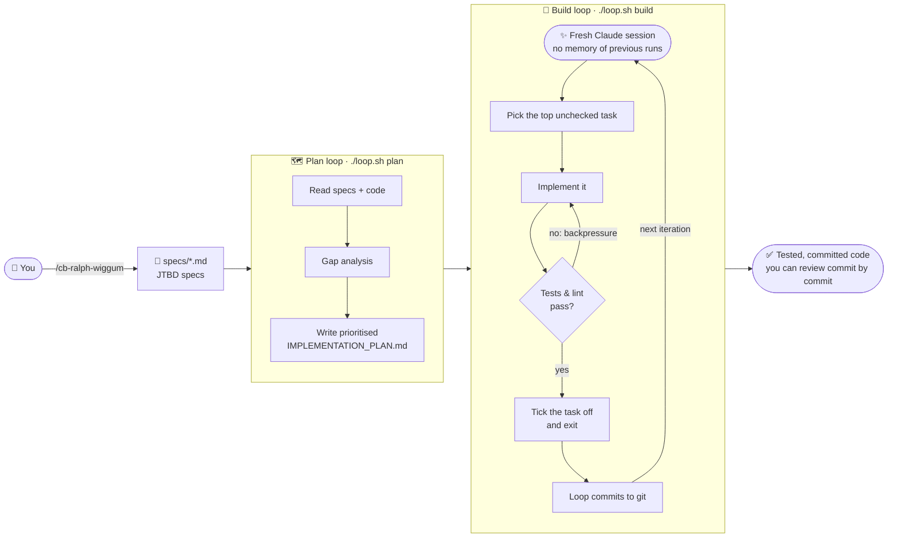

<p align="center">
  
</p>

<p align="center">
  <a href="https://docs.claude.com/en/docs/claude-code"></a>
  
  
  <a href="LICENSE"></a>
</p>

<p align="center">
  <b>Describe what you want built. Go and make a coffee. Come back to tested, committed code.</b><br>
  <sub>One slash command that sets up <a href="https://ghuntley.com/ralph/">Geoffrey Huntley's</a> <i>Ralph Wiggum</i> technique in any project.</sub>
</p>

---

## See it in action

<p align="center">
  
</p>

<p align="center"><sub>A scripted, sped-up replay of a typical session (a real build iteration takes minutes, not seconds).<br>Source: <a href="assets/demo/make_demo.py"><code>assets/demo/make_demo.py</code></a> → asciinema cast → GIF.</sub></p>

---

## The idea in 30 seconds

Long AI coding sessions get worse the longer they run. The context window fills with old attempts, dead ends and stale assumptions, and the model starts to drift.

**Ralph does the opposite. Every iteration is a brand-new Claude session that remembers nothing.** It reads the plan, does **one** task, proves it works with your tests, commits, and exits. Then the loop starts it again with a clean slate.

The memory lives in **files and git**, not in the model:

| Stored in | What it holds |
| --- | --- |
| `specs/*.md` | **What** to build: Jobs-To-Be-Done specs from a short interview |
| `IMPLEMENTATION_PLAN.md` | **What's next**: a prioritised checklist every iteration reads and updates |
| `AGENTS.md` | **How** to build, test and lint *this* project |
| `git log` | **What's done**: one reviewable commit per iteration |



### Why it works

- 🧠 **Fresh context every iteration.** No context rot and no slow drift. Iteration 50 is as sharp as iteration 1.
- 🧱 **Backpressure from your own tests.** A task isn't done until `npm test` (or whatever your project uses) passes, so bad output gets rejected automatically.
- 🎯 **One task per run.** Small, focused changes that are easy to review and easy to revert.
- 📜 **Everything is a commit.** Every iteration lands as its own git commit, so you can audit, bisect or roll back.
- 💸 **Cheap.** Around **$10/hour** of autonomous coding at Sonnet pricing (about $0.15–0.30 per iteration).
- 🪟🐧🍎 **Cross-platform.** PowerShell 7 for Windows, Bash for macOS, Linux, WSL and Git Bash.

---

## 🍩 The Geoffrey Huntley connection

**Ralph Wiggum is [Geoffrey Huntley's](https://ghuntley.com/) technique, not mine.** He came up with it, named it and made it popular. In its purest form it is a single line of Bash:

```bash
while :; do cat PROMPT.md | claude ; done
```

It's named after the Simpsons character: not the smartest kid in the room, but relentlessly persistent. Put a naive agent in a dumb loop, give it good specs and hard feedback from tests, and it gets a surprising amount of real software built.

**What this repo adds** is packaging. It turns the playbook into a single Claude Code command, so you can drop Ralph into any project in a couple of minutes:

- a guided **JTBD interview** that writes your `specs/`
- separate **plan** and **build** prompts based on Huntley's playbook
- loop scripts for **Bash _and_ PowerShell 7** with iteration limits and auto-commits
- an `AGENTS.md` pre-filled from your project's existing `CLAUDE.md`
- an optional **Playwright visual-verification** step in build mode

Read the original first: **[Ralph Wiggum as a "software engineer"](https://ghuntley.com/ralph/)** · **[how-to-ralph-wiggum playbook](https://github.com/ghuntley/how-to-ralph-wiggum)**

---

## 🚀 Quick start

**1. Install the slash command** (one time):

```bash
# macOS / Linux
cp commands/cb-ralph-wiggum.md ~/.claude/commands/
```
```powershell
# Windows (PowerShell)
copy commands\cb-ralph-wiggum.md $env:USERPROFILE\.claude\commands\
```

**2. Scaffold Ralph** in any project. Open Claude Code and run:

```
/cb-ralph-wiggum
```

Claude interviews you (goal, 2–5 jobs-to-be-done, definition of done), reads your `CLAUDE.md` for build and test commands, and generates everything.

**3. Plan, review, build:**

```bash
./loop.sh plan 3      # gap analysis → IMPLEMENTATION_PLAN.md
# ✋ review the plan and edit it if you like. It's just Markdown.
./loop.sh build 10    # up to 10 iterations, one task each
```
```powershell
.\loop.ps1 plan 3
.\loop.ps1 build 10
```

> [!TIP]
> If Ralph starts going in circles, or the plan no longer matches reality, run a single planning pass (`./loop.sh plan 1`) to regenerate the task list. Plans are disposable.

---

## 📁 What gets generated

```
your-project/
├── loop.sh                    # Bash loop (macOS / Linux / WSL / Git Bash)
├── loop.ps1                   # PowerShell 7 loop (Windows)
├── PROMPT_plan.md             # Planning mode: specs vs. code → task list
├── PROMPT_build.md            # Build mode: one task, validate, exit
├── AGENTS.md                  # Build / test / lint / visual-check commands
├── IMPLEMENTATION_PLAN.md     # Shared task list, updated every iteration
├── specs/                     # One JTBD spec per topic
│   ├── feature-a.md
│   └── feature-b.md
├── .gitignore                 # Created if absent
└── .gitattributes             # Created if absent (LF line endings)
```

Standalone copies of every generated file are in [`templates/`](templates/), with an example spec in [`examples/specs/`](examples/specs/).

<details>
<summary><b>Loop arguments</b></summary>

```bash
./loop.sh [plan|build] [max_iterations]

./loop.sh plan        # planning, unlimited iterations
./loop.sh plan 5      # planning, max 5 iterations
./loop.sh build       # building, unlimited iterations
./loop.sh build 20    # building, max 20 iterations
```

```powershell
.\loop.ps1 [plan|build] [max_iterations]

.\loop.ps1 plan 5
.\loop.ps1 -Mode build -MaxIterations 20   # named parameters work too
```

If PowerShell refuses to run the script because of the execution policy:

```powershell
Set-ExecutionPolicy -Scope Process -ExecutionPolicy Bypass
```
</details>

---

## ⚠️ Safety

Ralph runs Claude **unattended** with `--dangerously-skip-permissions`. Treat it like a junior engineer with root access.

- **Always set an iteration limit.** It caps both cost and blast radius.
- **Run it in a sandbox** (container, VM or a disposable clone) for anything you don't fully trust.
- **Review the commits.** Every iteration auto-commits, so `git log -p` is your audit trail.
- **Good tests matter.** Backpressure is only as strong as your test suite.

---

## 📚 Learn more

- 📝 [Ralph Wiggum as a "software engineer"](https://ghuntley.com/ralph/): Geoffrey Huntley's original article
- 📖 [how-to-ralph-wiggum](https://github.com/ghuntley/how-to-ralph-wiggum): the official playbook
- 🧭 [The Ralph Wiggum Playbook](https://paddo.dev/blog/ralph-wiggum-playbook/): a detailed walkthrough
- ⭐ [Awesome Ralph](https://github.com/snwfdhmp/awesome-ralph): curated resources

---

<p align="center">
  <sub>MIT licensed · Built by <a href="https://github.com/ChrisBrooksbank">Chris Brooksbank</a> · Ralph Wiggum technique by <a href="https://ghuntley.com/">Geoffrey Huntley</a></sub><br>
  <sub>If this saves you some typing, a ⭐ is appreciated.</sub>
</p>
